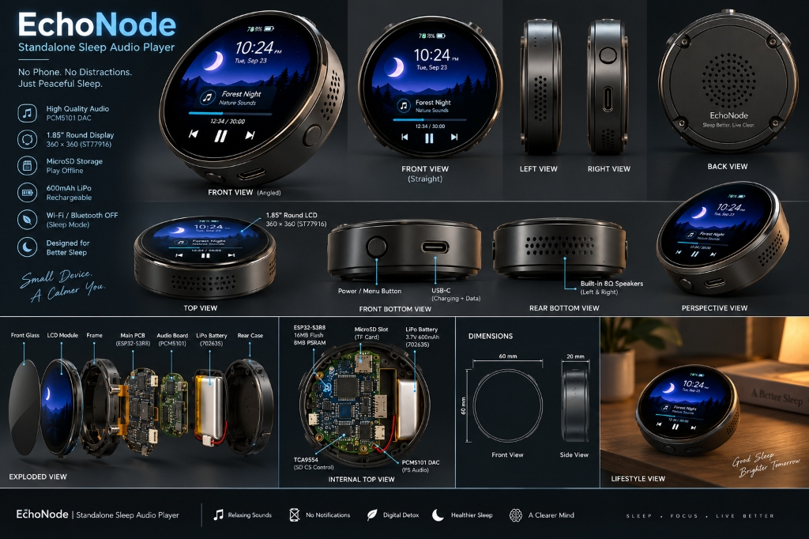

# 🌙 EchoNode: Standalone Bedside Audio Player

[](https://opensource.org/licenses/MIT)
[](https://www.waveshare.com)
[](https://fastapi.tiangolo.com)
[](https://lvgl.io)

**EchoNode** is an open-source, dedicated hardware bedside audio device engineered to solve a critical real-world problem: **preventing mobile phone dependency, eliminating cellular RF radiation, and silencing disruptive notifications right before and during sleep cycles.**

Built specifically for the **original Waveshare ESP32-S3-Touch-LCD-1.85 Development Board**, EchoNode delivers a zero-notification, dedicated bedside audio experience with strict memory lifecycle management, hardware safety policies, and a local web ingestion service.

---

## ⚡ Core Features

- 🎧 **Standalone SD Local Mode (Zero Radio):** Reads pure audio `.m4a` (AAC) or `.mp3` tracks directly from a FAT32 MicroSD card. Wi-Fi and Bluetooth baseband registers are powered off completely to maximize battery life and eliminate RF radiation.
- 🔊 **PCM5101 High-Fidelity Audio Core:** 3-wire I2S connection (`DIN=47`, `LRCK=38`, `BCK=48`) with internal PLL driving onboard miniature speakers.
- 💾 **TCA9554-Controlled MicroSD Storage:** Hardware Chip Select managed reliably through `EXIO3` on the onboard TCA9554 I2C IO expander (`0x20` on `SDA=11`, `SCL=10`).
- 🔄 **Real Finite State Machine & Memory Accounting:** Real FSM (`OFF`, `LOCAL_SD_STARTING`, `LOCAL_SD_ACTIVE`, `LOCAL_SD_STOPPING`, `BT_STARTING`, `BT_ACTIVE`, `BT_STOPPING`, `ERROR`) ensuring zero decoder leaks across repeated start/stop cycles.
- 📶 **Capability-Gated Bluetooth Architecture:** Deterministically reports `NOT_SUPPORTED` on ESP32-S3 due to absence of Classic Bluetooth (BR/EDR) hardware, maintaining architectural honesty while providing an extensible interface for future external Bluetooth coprocessors.
- 🛡️ **Built-in Safety Policies:**
  - `RULE_VOLUME_CEILING`: Digital volume hard-capped at $\le 65\%$ to prevent dynamic coil distortion and brownout voltage sags.
  - `RULE_I2S_MUTING`: Automatic hardware mute and DMA clearing on stop/pause to silence all ambient hiss and high-frequency EMI.
  - `RULE_THERMAL_SHUTDOWN`: 30-minute idle sleep timeout prevents heat entrapment near bedding and pillows.
  - 10-second automatic screen backlight dimming on `GPIO 5` for pitch-black sleep environments.
- 🌐 **Web Ingestion Hub:** FastAPI + `yt-dlp` local backend service that takes YouTube links, strictly strips video tracks, verifies **zero video streams** exist in the container, and formats them into clean `.m4a` files with FAT32-safe filenames for MicroSD transfer.
- 🎨 **Circular LVGL User Interface:** Custom UI tailored for the 360×360 ST77916 circular display (Screen Alpha: Clock/Battery/Mode, Screen Beta: 1Hz SD Player, Screen Gamma: Bluetooth Status).

---

<p align="center">
  
</p>

---

## 📁 Repository Structure

```
EchoNode/
├── images/                   # Visual documentation, 3D renders, components & assembly photos
│   ├── renders/              # Multi-angle product render, exploded view & dimensions
│   ├── components/           # Unboxing & bench photos of bare hardware modules
│   ├── assembly/             # Step-by-step physical assembly & wiring photos
│   └── prototype/            # Bench testing, diagnostic screen & power measurements
├── backend/                  # FastAPI web service & yt-dlp audio extractor
│   ├── app/                  # Application routes, models, config, and extractor service
│   ├── static/               # Modern dark-mode web dashboard UI
│   ├── tests/                # Unit tests, live extraction, and audio-only validation
│   ├── downloads/            # Staged audio files ready for SD transfer
│   └── requirements.txt      # Python dependencies
├── firmware/                 # Production firmware for original Waveshare ESP32-S3 Round LCD
│   ├── include/              # Hardware pinouts, TCA9554 driver, FSM, and LVGL config
│   ├── src/                  # Audio manager, display manager, power manager, SD manager
│   ├── platformio.ini        # PlatformIO build configuration (16MB Flash, 8MB PSRAM OPI)
│   └── partitions_16MB.csv   # Audited flash partition table (4MB app0, 4MB app1, 2MB spiffs)
├── tools/                    # Verification & diagnostic utilities
│   ├── audit_pin_mappings.py # Validates GPIOs against authoritative Waveshare original board mapping
│   ├── check_partitions.py   # Validates partition boundaries and 4KB/64KB alignments
│   ├── generate_test_tones.py# Uncompressed 440Hz / stereo sweep hardware test tones
│   └── sd_card_verifier.py   # FAT32 and read/write throughput validator
├── enclosure/                # Parametric 3D printable bedside case (OpenSCAD)
├── docs/                     # Detailed wiring guides, assets and hardware interconnects
├── ARCHITECTURE.md           # System topology and state machine matrix
├── DESIGN.md                 # LVGL UI guidelines and screen coordinate maps
├── MEMORY.md                 # Flash partitioning and PSRAM/SRAM allocation rules
├── PDR.md                    # Product Design Requirements specification
├── RULES.md                  # Safety directives and firmware policies
└── TASK.md                   # Project engineering task roadmap
```

---

## 🚀 Quickstart Guide

### 1. Developer Commands (`make`)

The repository includes a comprehensive `Makefile` for developer workflows:

```bash
make help               # List all developer targets
make audit-pins         # Verify hardware pin definitions against authoritative Waveshare original spec
make check-partitions   # Verify 4KB/64KB flash partition alignments and boundaries
make test-backend       # Run backend unit tests and audio-only validation
make test-tones         # Generate uncompressed hardware test tones in backend/downloads/
make verify-sd          # Check and benchmark connected MicroSD card
make run-backend        # Start FastAPI YouTube extraction hub on http://localhost:8000
```

### 2. Flashing the ESP32-S3 Firmware

```bash
cd firmware

# Flash main bedside player firmware
pio run -e waveshare_esp32s3_round --target upload

# Or flash on-board hardware diagnostic self-test
pio run -e diagnostics --target upload

# Monitor serial output at 115200 baud
pio run --target monitor
```

---

## ⚠️ Hardware Safety Directives

* **`RULE_POLARITY_CHECK`:** Before connecting any battery to the board's MX1.25 connector, verify the positive and negative leads against the PCB silkscreen with a digital multimeter. Swapped polarity will destroy the onboard charging IC.
* **MicroSD Requirements:** Use cards $\le 32\text{GB}$ formatted as **FAT32**.
* **Charging Safety:** Never recharge the unit beneath pillows, blankets, or bedding.

---

## 📄 License
This project is open-source under the [MIT License](LICENSE).
